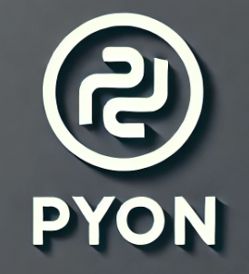

# **pyon** -- **PYONTools**
PYON is Python Object Notation -- A Superset of JSON (javascript object notation) that expresses python sets, tuples, dicts, lists, funcs, etc.

PYON already exists. It is defined by what you get if you f-string f"{any_object}" to any_object, and is generally what you get with the `__repr__` method. Thus, we only need to 
document it, and provide some tools for working with it. Better than PICKLE, jsonpickle, and other variants of JSON.

PYON provides safe and convenient methods for encoding, decoding, and compacting Python-native objects, making it particularly useful when working with **CSV files**, **Python-native structures**, or ensuring **external compatibility** with tools like JSON. 

**PYONTools** is a lightweight Python module for working with **PYON**. PYON provides safe and convenient methods for encoding, decoding, and compacting Python-native objects, making it particularly useful when working with **CSV files**, **Python-native structures**, or ensuring **external compatibility** with tools like JSON.

---

## **What Makes PYON Unique**

1. **Superset of JSON**:  
   - Any valid JSON is also valid PYON, ensuring compatibility with JSON-based systems.
   - Additionally, PYON extends JSON to support Python-specific features.
   - Human-readable, it is self-documenting and better than pickling.

2. **Easy-going**:
   - **Trailing Commas**: PYON allows trailing commas in lists, tuples, and dictionaries, following Python syntax.
   - **Both Single and Double Quotes**: String literals can use either single (`'`) or double (`"`) quotes for flexibility.
   - **PEP 8 Compliance**: Canonical PYON enforces (much of) Python’s style guide with regard to formatting __REPR__ output, for consistent and human-readable formatting.
   - **Optional comments**: Optional comments can be embedded in multi-line PYON using `# comment(newline)`

3. **Beyond JSON**:  
   PYON supports Python-native types and constructs that JSON cannot represent, including:
   - Non-string dictionary keys (integers, tuples, None).
   - Sets and tuples
   - Arbitrary objects if `__repr__` is defined
   - Function and class references are provided using module-qualified names

---

## **Features**

- ✅ **pyon_encode(obj)**: Generate PYON representations using Python's `repr()` for native compatibility.
   - Any object evaluated by f-string {} maybe suitable PYON, as long as it can be used to recreate the object.
   - csv.writer() automatically generates PYON in the csv cell if an object is evaluated
- ✅ **pyon_decode(pyon_str)**: Convert PYON strings back into Python objects safely, thus avoiding risk of active code injection.
- ✅ **Compact Representation**: By default, PYON follows PEP-8 conventions for readability. May remove unnecessary spaces for minimal output.
- ✅ **JSON Compatibility**: Any JSON is also PYON, but some PYON-compatible objects may not be JSON, however some (like tuples) can be converted to lists.
   - pyon_to_json() provides safe conversion to json that will provide an error if the data cannot be converted.
- ✅ **CSV-Friendly**: Seamlessly integrates with Python’s built-in `csv` module for reading and writing.
   - csv.writer() already produces PYON.
   - csv.reader() does not convert the PYON string representation, but it can be easily unstringified using `pyon_decode()`

---

## **PYON vs JSON vs PICKLE**

PYON is an **enhanced version of JSON** that embraces Python-native features, making it more versatile for Python developers instead of trying to use only 
JSON and stumbling over unsupported data types.

| **Feature**                    | **PYON**                                | **JSON**                  | **Pickle**                          |
|--------------------------------|-----------------------------------------|---------------------------|-------------------------------------|
| Non-string dictionary keys     | ✅ Supported                            | ❌ Not allowed            | ✅ Supported                        |
| Set data type                  | ✅ Supported                            | ❌ Not supported          | ✅ Supported                        |
| Tuple data type                | ✅ Supported                            | ❌ Not supported          | ✅ Supported                        |
| Function/Class references      | ✅ Represented by module and name       | ❌ Not serializable       | ✅ Serialized as (nonportable) references  |
| Arbitrary data object          | ✅ Supported if `__repr__` provided     | ❌ Not supported          | ✅ Fully supported                  |
| Trailing commas                | ✅ Supported                            | ❌ Not allowed            | ❌ Not applicable                   |
| Single and double quotes       | ✅ Both allowed                         | ❌ Only double quotes     | ❌ Not applicable (binary format)   |
| Readability                    | ✅ Human-readable (PEP 8 compliant)     | ✅ Human-readable         | ❌ Not human-readable               |
| Comments allowed               | ✅ Supported using pre-parser           | ❌ Not supported          | ❌ Not applicable
| Cross-language compatibility   | ❌ Python-specific but easily converted | ✅ Supported across tools | ❌ Python-specific only             |
| In standard library            | ❌ No, undocumented format (until now!) | ✅ Yes                    | ✅ Yes                              |

### other tools
- orjson is an extremely fast JSON parser, and it can accept integer keys, but they are converted to strings.
- jsonpickle - can represent many python objects in JSON but to process them, the jsonpickle parser is required.

---

## **Example Demonstrating Flexibility**

```python
from pyontools import pyontools

# PYON handles non-string keys, sets, and tuples
data = {
    1: "integer key",          # Non-string key
    "set": {1, 2, 3},          # Set type
    "tuple": (1, 2, 3),        # Tuple type
    "nested": {"a": True, "b": [1, 2, 3]},
}

# PYON Representation
pyon_str = pyontools.pyon_encode(data)
print("PYON:", pyon_str)

# Safe decoding
decoded = pyontools.pyon_decode(pyon_str)
print("Decoded:", decoded)

# JSON attempt (will fail)
import json
try:
    json_str = json.dumps(data)
except TypeError as e:
    print("JSON Error:", e)
```

**Output**:
```plaintext
PYON: {1: 'integer key', 'set': {1, 2, 3}, 'tuple': (1, 2, 3), 'nested': {'a': True, 'b': [1, 2, 3]}}
Decoded: {1: 'integer key', 'set': {1, 2, 3}, 'tuple': (1, 2, 3), 'nested': {'a': True, 'b': [1, 2, 3]}}
JSON Error: *** TypeError: Object of type set is not JSON serializable
```

---

## **Installation**

Copy the `pyontools.py` file into your project directory.

If you plan to expand this into a full package, it can be installed from PyPI in the future.

---

## **License**

This project is licensed under the MIT License.

---

## **Future Plans**
- Push for support of PYON within all functionality in the standard library, such as SQLite where JSON is supported but not PYON.
- Enhance csv.writer to allow for compact mode, where spaces are not used after colons and commas (contrary to PEP8 formatting).
- Enhance __repr__ output to allow, in general, to use double-quotes instead of single quotes. This makes PYON lists and dict compatible with JSON if only string keys are used.

---

## **Feedback and Contributions**

Contributions and feedback are welcome! If you encounter any issues or have feature suggestions, feel free to submit them. 🚀
